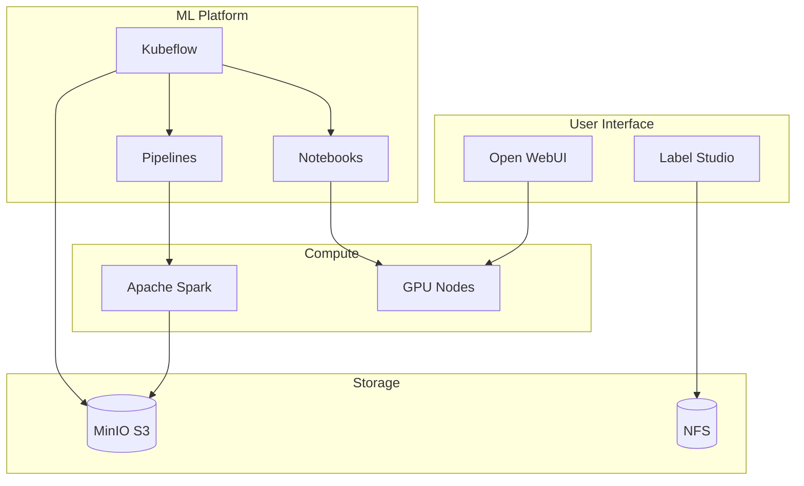

# AI Platforms

This section covers the AI and machine learning platforms deployed in the homelab.

## Platform Overview



## Deployed Platforms

| Platform | Purpose | URL | Status |
|----------|---------|-----|--------|
| [Kubeflow](kubeflow.md) | ML pipelines & notebooks | kubeflow.homelab.local | :material-check: Active |
| [Open WebUI](openwebui.md) | LLM chat interface | webui.homelab.local | :material-check: Active |
| [Label Studio](labelstudio.md) | Data labeling | labels.homelab.local | :material-check: Active |
| [Spark](spark.md) | Distributed compute | spark.homelab.local | :material-check: Active |

## Resource Allocation

AI workloads have dedicated resource pools:

```yaml title="GPU Node Taint"
taints:
  - key: nvidia.com/gpu
    value: "true"
    effect: NoSchedule
```

### Typical Resource Requirements

| Workload | CPU | Memory | GPU |
|----------|-----|--------|-----|
| Jupyter Notebook | 2-4 | 4-8Gi | Optional |
| LLM Inference | 4-8 | 16-32Gi | Required |
| Spark Job | 1-2/executor | 2-4Gi/executor | - |
| Label Studio | 1-2 | 2-4Gi | - |

## Topics

- **[Kubeflow](kubeflow.md)** - ML platform for pipelines and notebooks
- **[Open WebUI](openwebui.md)** - Web interface for LLM interaction
- **[Label Studio](labelstudio.md)** - Data labeling and annotation
- **[Spark](spark.md)** - Distributed data processing

## Authentication

All AI platforms integrate with Authentik for SSO:

!!! info "OIDC Integration"
    Users authenticate via `auth.homelab.local` and are automatically logged into AI platforms based on group membership.

See [OIDC Integration](../operations/oidc.md) for setup details.
