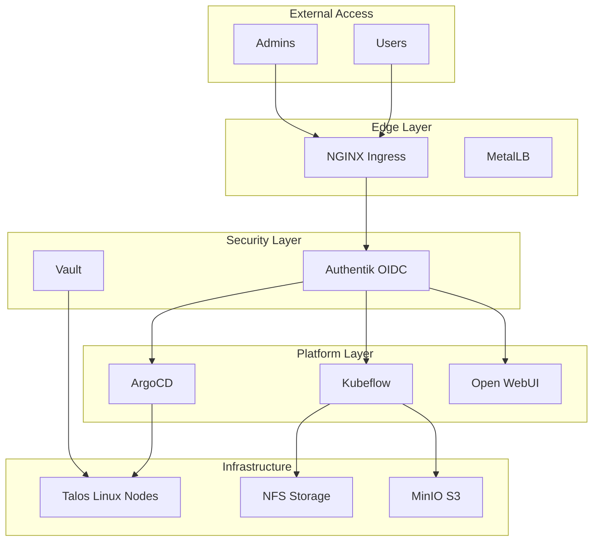

# Homelab Documentation

Welcome to the homelab infrastructure documentation. This site contains architecture guides, operational runbooks, and reference material for our Kubernetes-based homelab.

## Quick Links

-   :material-kubernetes:{ .lg .middle } **Kubernetes**

    ---

    Cluster setup, workload management, storage, and security

    [:octicons-arrow-right-24: Kubernetes docs](kubernetes/index.md)

-   :material-lan:{ .lg .middle } **Networking**

    ---

    Ingress, service mesh, load balancing, and DNS configuration

    [:octicons-arrow-right-24: Networking docs](networking/index.md)

-   :material-robot:{ .lg .middle } **AI Platforms**

    ---

    Kubeflow, Open WebUI, Label Studio, and Spark deployments

    [:octicons-arrow-right-24: AI Platform docs](ai-platforms/index.md)

-   :material-cog:{ .lg .middle } **Operations**

    ---

    GitOps, secrets management, monitoring, and authentication

    [:octicons-arrow-right-24: Operations docs](operations/index.md)

## Cluster Overview

## Getting Started

New to this cluster? Start here:

1. **[Cluster Setup](kubernetes/talos-setup.md)** - How the cluster was bootstrapped
2. **[Networking Overview](networking/index.md)** - Understanding traffic flow
3. **[Authentication](operations/authentik.md)** - How to get access
4. **[ArgoCD](operations/argocd.md)** - Deploying workloads via GitOps

## Recent Updates

| Date | Change | Component |
|------|--------|-----------|
| 2024-01 | Initial documentation | All |

!!! tip "Contributing"
    All documentation is maintained in Git. Submit PRs to propose changes.
