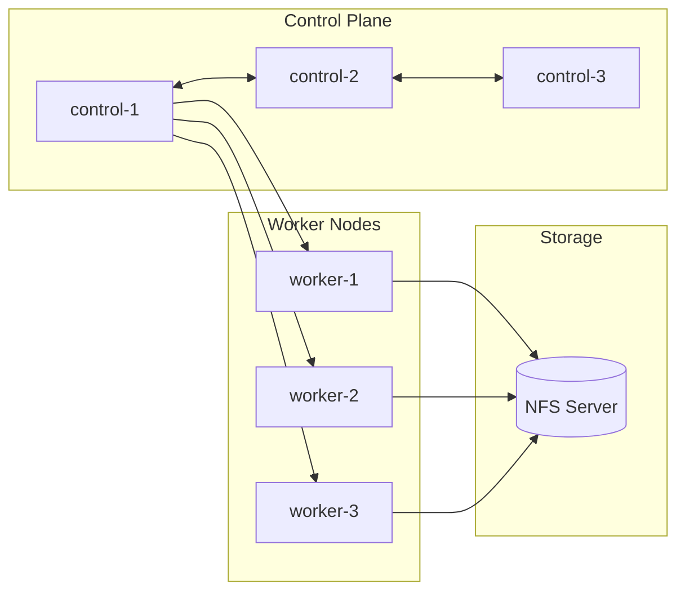

# Kubernetes

This section covers the Kubernetes cluster infrastructure, including setup, workload management, storage, and security.

## Cluster Architecture

The homelab runs on **Talos Linux**, a minimal, immutable, and secure Kubernetes OS.



## Key Components

| Component | Purpose | Documentation |
|-----------|---------|---------------|
| Talos Linux | Kubernetes OS | [Setup Guide](talos-setup.md) |
| NFS CSI | Persistent storage | [NFS CSI](nfs-csi.md) |
| RBAC | Access control | [RBAC Guide](rbac.md) |
| Network Policies | Traffic isolation | [Network Policies](network-policies.md) |

## Quick Reference

### Common Commands

=== "Nodes"

    ```bash
    # List all nodes
    kubectl get nodes -o wide

    # Describe a node
    kubectl describe node <node-name>

    # Cordon/uncordon a node
    kubectl cordon <node-name>
    kubectl uncordon <node-name>
    ```

=== "Pods"

    ```bash
    # List pods in all namespaces
    kubectl get pods -A

    # Get pod logs
    kubectl logs -f <pod-name> -n <namespace>

    # Execute into a pod
    kubectl exec -it <pod-name> -n <namespace> -- /bin/sh
    ```

=== "Deployments"

    ```bash
    # List deployments
    kubectl get deployments -A

    # Scale a deployment
    kubectl scale deployment <name> --replicas=3 -n <namespace>

    # Rollout status
    kubectl rollout status deployment/<name> -n <namespace>
    ```

## Topics

- **[Talos Setup](talos-setup.md)** - Cluster bootstrapping with Talos Linux
- **[Node Configuration](node-config.md)** - Node-level settings and tuning
- **[Cluster Networking](cluster-networking.md)** - CNI and pod networking
- **[Deployments](deployments.md)** - Managing stateless workloads
- **[StatefulSets](statefulsets.md)** - Managing stateful workloads
- **[Jobs & CronJobs](jobs.md)** - Batch processing
- **[NFS CSI](nfs-csi.md)** - Network storage driver
- **[Persistent Volumes](persistent-volumes.md)** - Storage provisioning
- **[RBAC](rbac.md)** - Role-based access control
- **[Network Policies](network-policies.md)** - Traffic rules
- **[Pod Security](pod-security.md)** - Security standards
