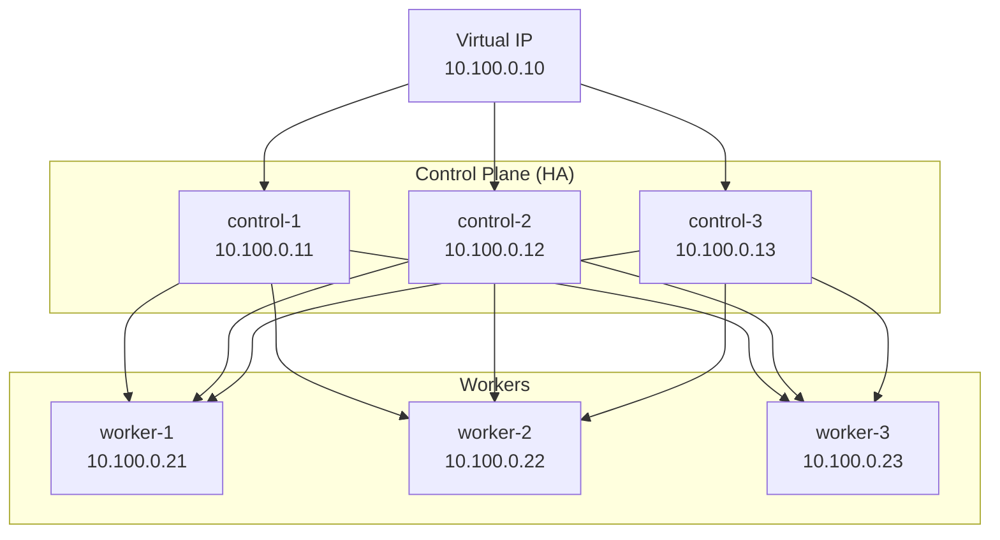

# Talos Linux Setup

This guide covers bootstrapping a Kubernetes cluster using Talos Linux.

## Overview

[Talos Linux](https://www.talos.dev/) is a modern OS designed for Kubernetes:

- **Immutable** - No shell, no SSH, API-driven
- **Minimal** - Only what's needed for Kubernetes
- **Secure** - Hardened by default, signed images

## Prerequisites

!!! warning "Requirements"
    - 3+ nodes for HA control plane
    - 2GB+ RAM per node (4GB recommended)
    - 10GB+ disk per node
    - Network connectivity between all nodes

## Architecture



## Installation Steps

### 1. Generate Configuration

```bash
# Generate secrets
talosctl gen secrets -o secrets.yaml

# Generate configs using secrets
talosctl gen config homelab https://10.100.0.10:6443 \
    --with-secrets secrets.yaml \
    --output-dir ./talos-config
```

### 2. Customize Machine Configs

Edit `controlplane.yaml` for control plane nodes:

```yaml title="controlplane.yaml"
machine:
  type: controlplane
  network:
    hostname: control-1
    interfaces:
      - interface: eth0
        dhcp: false
        addresses:
          - 10.100.0.11/24
        routes:
          - network: 0.0.0.0/0
            gateway: 10.100.0.1
    nameservers:
      - 10.100.0.1

  # Enable virtual IP for HA
  network:
    interfaces:
      - interface: eth0
        vip:
          ip: 10.100.0.10

cluster:
  controlPlane:
    endpoint: https://10.100.0.10:6443
```

### 3. Apply Configuration

```bash
# Apply to first control plane node
talosctl apply-config --insecure \
    --nodes 10.100.0.11 \
    --file controlplane.yaml

# Bootstrap the cluster (only on first node!)
talosctl bootstrap --nodes 10.100.0.11

# Get kubeconfig
talosctl kubeconfig --nodes 10.100.0.10
```

### 4. Add Additional Nodes

```bash
# Apply to additional control plane nodes
talosctl apply-config --insecure \
    --nodes 10.100.0.12 \
    --file controlplane-2.yaml

# Apply to worker nodes
talosctl apply-config --insecure \
    --nodes 10.100.0.21 \
    --file worker.yaml
```

## Verification

```bash
# Check node status
kubectl get nodes -o wide

# Expected output:
# NAME        STATUS   ROLES           VERSION   INTERNAL-IP
# control-1   Ready    control-plane   v1.29.0   10.100.0.11
# control-2   Ready    control-plane   v1.29.0   10.100.0.12
# control-3   Ready    control-plane   v1.29.0   10.100.0.13
# worker-1    Ready    <none>          v1.29.0   10.100.0.21
# worker-2    Ready    <none>          v1.29.0   10.100.0.22
# worker-3    Ready    <none>          v1.29.0   10.100.0.23
```

## Troubleshooting

??? question "Node stuck in NotReady?"
    Check kubelet and container runtime status:
    ```bash
    talosctl service kubelet --nodes <node-ip>
    talosctl dmesg --nodes <node-ip> | tail -50
    ```

??? question "etcd issues?"
    Check etcd member list:
    ```bash
    talosctl etcd members --nodes 10.100.0.11
    ```

## Next Steps

- [Node Configuration](node-config.md) - Fine-tune node settings
- [Cluster Networking](cluster-networking.md) - Configure CNI
- [NFS CSI](nfs-csi.md) - Set up persistent storage
