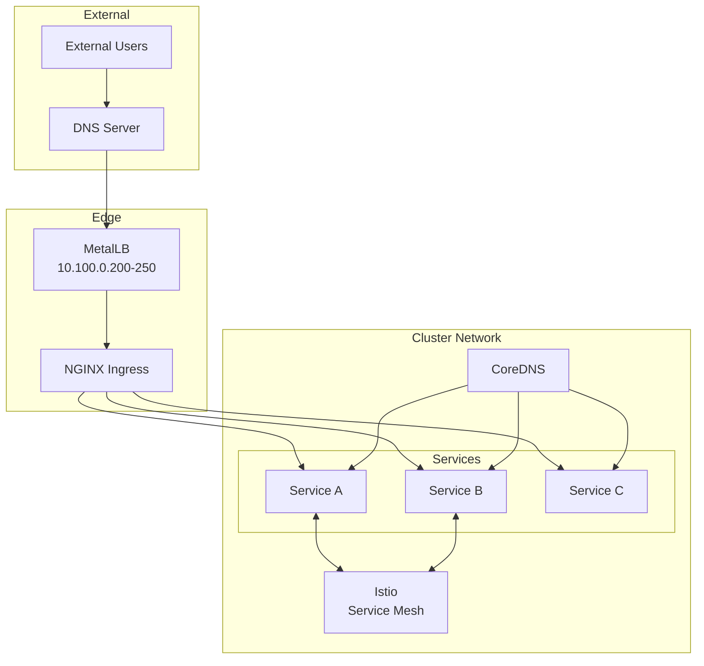

# Networking

This section covers the networking architecture of the homelab cluster, including ingress, service mesh, load balancing, and DNS.

## Network Architecture



## Components

| Component | Purpose | IP/Port | Documentation |
|-----------|---------|---------|---------------|
| NGINX Ingress | HTTP(S) routing | ClusterIP | [NGINX Ingress](nginx-ingress.md) |
| MetalLB | Load balancer | 10.100.0.200-250 | [MetalLB](metallb.md) |
| CoreDNS | Cluster DNS | 10.96.0.10:53 | [CoreDNS](coredns.md) |
| Istio | Service mesh | - | [Istio](istio.md) |

## Network Policies

The cluster uses network policies to restrict traffic:

```yaml title="Default deny policy"
apiVersion: networking.k8s.io/v1
kind: NetworkPolicy
metadata:
  name: default-deny-all
spec:
  podSelector: {}
  policyTypes:
    - Ingress
    - Egress
```

See [Network Policies](../kubernetes/network-policies.md) for details.

## IP Address Allocation

| Range | Purpose |
|-------|---------|
| 10.100.0.0/24 | Node IPs |
| 10.100.0.10 | Control plane VIP |
| 10.100.0.200-250 | MetalLB pool |
| 10.96.0.0/12 | Service CIDR |
| 10.244.0.0/16 | Pod CIDR |

## DNS Configuration

All services use the pattern `<service>.homelab.local`:

| Service | DNS Name |
|---------|----------|
| ArgoCD | argocd.homelab.local |
| Authentik | auth.homelab.local |
| Vault | vault.homelab.local |
| Docs | docs.homelab.local |

## Topics

- **[NGINX Ingress](nginx-ingress.md)** - HTTP routing and TLS termination
- **[TLS & Certificates](tls-certificates.md)** - Certificate management
- **[Istio](istio.md)** - Service mesh configuration
- **[MetalLB](metallb.md)** - Bare-metal load balancer
- **[CoreDNS](coredns.md)** - Cluster DNS
- **[External DNS](external-dns.md)** - Automatic DNS registration
