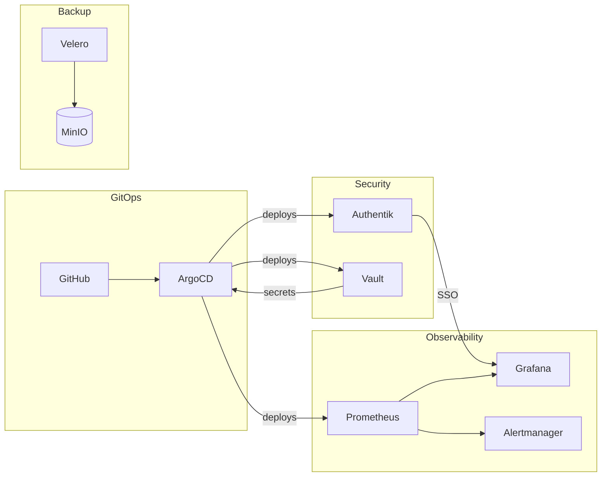

# Operations

This section covers operational aspects of the homelab: GitOps, secrets management, monitoring, authentication, and backup.

## Operational Stack



## Components

### GitOps

| Component | Purpose | URL |
|-----------|---------|-----|
| [ArgoCD](argocd.md) | Continuous delivery | argocd.homelab.local |

### Security

| Component | Purpose | URL |
|-----------|---------|-----|
| [Authentik](authentik.md) | Identity provider | auth.homelab.local |
| [Vault](vault.md) | Secrets management | vault.homelab.local |

### Observability

| Component | Purpose | URL |
|-----------|---------|-----|
| [Prometheus](prometheus.md) | Metrics collection | prometheus.homelab.local |
| [Grafana](grafana.md) | Dashboards | grafana.homelab.local |

### Backup

| Component | Purpose | Storage |
|-----------|---------|---------|
| [Velero](velero.md) | Cluster backup | MinIO S3 |

## Runbooks

### Common Operations

=== "Deploy Changes"

    ```bash
    # Sync an ArgoCD application
    argocd app sync <app-name>

    # Watch sync status
    argocd app wait <app-name>
    ```

=== "Rotate Secrets"

    ```bash
    # Generate new secret in Vault
    vault kv put secret/app/db password=$(openssl rand -base64 32)

    # Restart pods to pick up new secret
    kubectl rollout restart deployment/<app> -n <namespace>
    ```

=== "Scale Workloads"

    ```bash
    # Scale deployment
    kubectl scale deployment/<name> --replicas=3 -n <namespace>

    # Scale via ArgoCD (persists in Git)
    # Edit values.yaml and push to Git
    ```

## Incident Response

!!! danger "Emergency Procedures"
    1. **Identify** - Check Grafana dashboards and Alertmanager
    2. **Contain** - Scale down affected workloads if needed
    3. **Investigate** - Review logs in Grafana/Loki
    4. **Remediate** - Apply fix via GitOps
    5. **Document** - Update runbooks

## Topics

- **[ArgoCD](argocd.md)** - GitOps continuous delivery
- **[Vault](vault.md)** - Secrets management
- **[Prometheus](prometheus.md)** - Metrics and alerting
- **[Grafana](grafana.md)** - Visualization and dashboards
- **[Authentik](authentik.md)** - Identity and access management
- **[OIDC Integration](oidc.md)** - Single sign-on setup
- **[Velero](velero.md)** - Backup and disaster recovery
